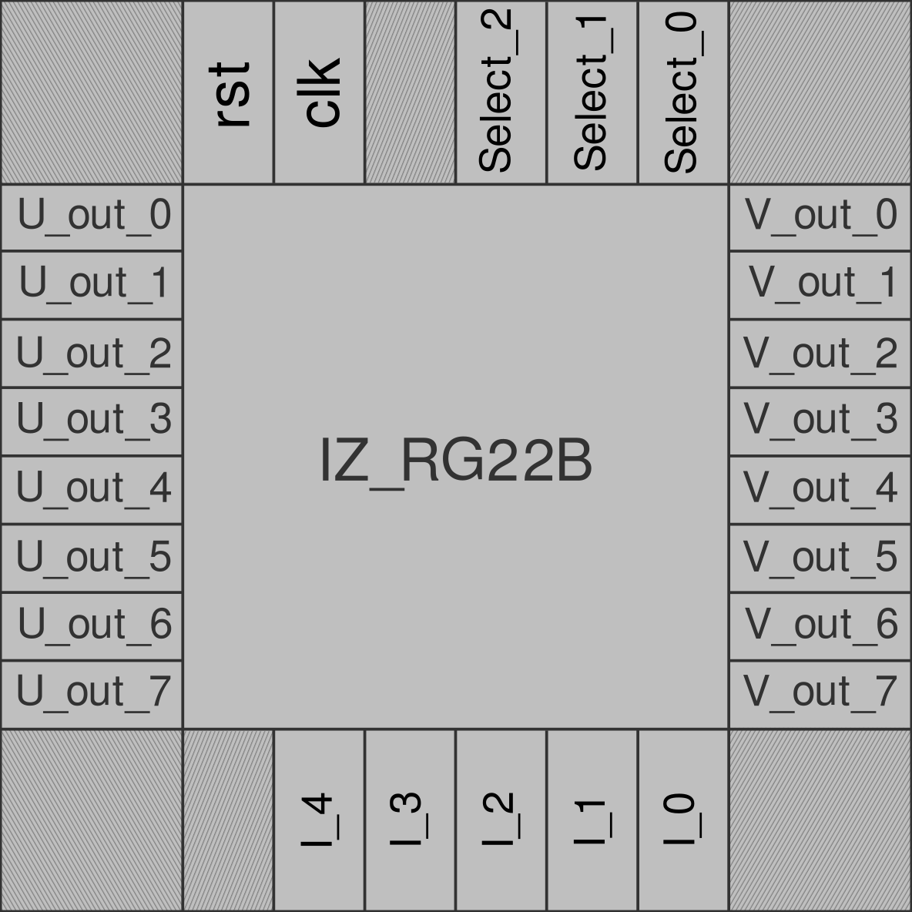
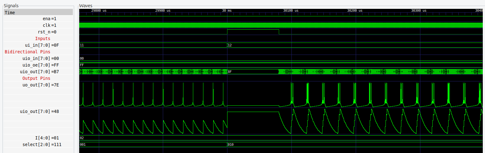

# Izhikevich Neuron Model equations implemented in 22-Bit on Verilog

The project implements neuron behaviors based on the Izhikevich equation. The internal operations work on a 22-bit Q3.18 fixed format. To achieve accurate neuron behavior, the original equations have been modified as shown below.

---


## How it works

The model combines the biological realism of Hodgkin-Huxley-type dynamics with the computational efficiency of integrate-and-fire neurons, enabling the simulation of spiking cortical neurons. However, working with digital circuits presents challenges in executing the necessary operations for Euler integration methods, as noted by Nadiri Andabili, Nazari, and Moosazadeh (2025). To address these issues, the following Izhikevich Neuron Model equations were proposed based on the findings of Nadiri Andabili, Nazari, and Moosazadeh (2025)

```math
V_m' = 4V_m^2 + 5V_m + 1.3947 - 0.3157U_m + I
```

```math
U_m' = a(3.1666bV - (U_m+0.0166))
```

As a consequence, the operational range was changed from [-65, 30] to [-0.65, 0.30],  also changing its reset to:

```math
\text{if } V \geq V_{TH} \text{ then }
\begin{cases}
V_{old} \leftarrow c \\
V \leftarrow c \\
U_{old} \leftarrow U + d \\
U \leftarrow U + d
\end{cases}\\
\text{else}
\begin{cases}
V \leftarrow V_{old} \\
U \leftarrow U_{old}
\end{cases}

```

As a result, the following schematic was implemented. The SELECT pins function as a multiplexer, allowing the neuron behavior to be set to one of the options described in the 'Parameter Selection' section. The other five input pins represent a current, I, which is mapped from 0.0066 to 0.994. The sixteen output pins include eight that represent the membrane potential, V_out, in a fixed Q0.7 format, as well as another eight output bits for the membrane recovery variable.

## Parameter selection


| Select | a    | b    | c    | d    | U    | V    |
| ------ | ---- | ---- | ---- | ---- | ---- | ---- |
| 3'b000 | 0.02 | 0.20 | 0.65 | 8    | 0.20 | 0.65 |
| 3'b001 | 0.02 | 0.20 | 0.55 | 4    | 0.20 | 0.65 |
| 3'b010 | 0.02 | 0.20 | 0.50 | 2    | 0.20 | 0.65 |
| 3'b011 | 0.10 | 0.20 | 0.65 | 2    | 0.20 | 0.65 |
| 3'b100 | 0.02 | 0.25 | 0.65 | 0.05 | 0.25 | 0.65 |
| 3'b101 | 0.02 | 0.25 | 0.87 | 0.05 | 0.25 | 0.65 |
| 3'b110 | 0.10 | 0.25 | 0.65 | 2    | 0.25 | 0.65 |
| 3'b111 | 0.02 | 0.25 | 0.65 | 2    | 0.25 | 0.65 |

---

## How to test

In the testbench, it is only necessary to set the operating frequency (10 MHz) and the input current I. In the end, results like the following should be obtained:



---
## External hardware

To externally observe the signals, it is necessary to invert the outputs `V_out` and `U_out` using NOT gates and connect them to an oscilloscope capable of performing bit-level measurements.

## 📑 "References (cited in the text)"

This model was proposed by Izhikevich (2003), and allows simulating various types of neurons by changing only the parameters a, b, c, and d.

---

## 📚 Referencias

- Izhikevich, E. M. (2003). *Simple model of spiking neurons*. IEEE Transactions on Neural Networks, 14(6), 1569–1572. [PDF](https://www.izhikevich.org/publications/spikes.pdf)
- Izhikevich, E. M. (2004). *Which model to use for cortical spiking neurons?* IEEE Transactions on Neural Networks, 15(5), 1063–1070. [PDF](https://www.izhikevich.org/publications/whichmod.pdf)
- M. Nadiri Andabili, S. Nazari, y T. Moosazadeh, “Chaotic dynamics analysis and digital hardware design of the Izhikevich neuron model,” Scientific Reports, vol. 15, art. 16766, 2025. 
