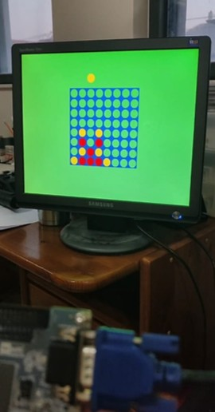
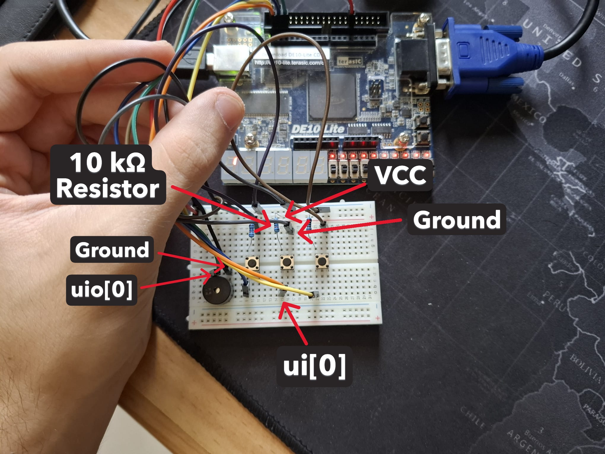

<!---

This file is used to generate your project datasheet. Please fill in the information below and delete any unused
sections.

You can also include images in this folder and reference them in the markdown. Each image must be less than
512 kb in size, and the combined size of all images must be less than 1 MB.
-->

## How it works

The project is a Connect Four game and utilizes hardware to determine the game state, update it and output it via VGA. The memory of the game state is stored in Flip Flops.

Short description of the modules involved:

#### `tt_um_RoyTr16.v`
The top module of the project, connect all top components and the IOs of the board.

#### `btn_debounce.v`
Responsible for allowing the action keys to be pressed without a single press being registered as multiple rapid presses.

#### `debug_controller.v`
Responsible for allowing the running of gate level tests by giving access to internal signals and outputting them to the IOs.

#### `connect_four_top.v`
The top wrapper module for the game. Connects to the internal logic module and calculates the VGA color output of each pixel according to the game state.

#### `vga_controller.v`
Generates the VGA clock and required signals for outputting to a VGA screen.

#### `connect_four.v`
The heart of the game's logic. stores many state variables and has a state machine to determine the status of the game. Instantiates other logic modules and connects between them.

#### `board_rw.v`
Responsible for storing the game state in a 128 bit vector which represents the board. Allows reading the contents of a grid tile by specifying its row and column indices, as well as writing to a grid tile. This implementation was the most area efficient which I was able to achieve, after wiring the entire 128 bit board to every component which needed it used a lot of area.

#### `game_sounds.v`
Responsible for generating game sounds via an external buzzer. Receives a trigger to play a sound as well as its type as inputs. Has four types of sound effects: "Start", "Drop", "Error" and "Victory".

#### `buzzer.v`
Responsible for generating the square wave for the buzzer, and is controller by `game_sounds`.

#### `victory_checker.v`
Responsible for checking whether the game has ended due to one of the players having a winning combination of pieces. This process happened by sequentially going over all relevant direction (determined by `check_directions`) and checking whether they conatain a winning combination. If any of them do, the game ends. If not, we move to the next turn.

#### `check_directions.v`
Responsible for checking which directions need to be examined to see whether they contain a winning combination. This module is required because for example say we want to check for a winning combination that is to the left of the tile which a piece was just added to, if we are at the left edge of the board, we would wrap around to the other side of the board and read incorrect data, causing false positives. This components ensures only directions which have the ability to cause a victory are examined.

#### `direction_checker.v`
Responsible for checking whether a specific direction has a winning combination. Receives as an input a tile index and a direction, as well as start signal. After the start signal, the module outputs sequentially the indices of the tiles in the relevant direction, reads them from `board_rw`, and stores them. Then, it checks whether the contents of the tiles are identical and not empty. If they are, the player whose pieces are in the winning combination is set to be the winner of the game.

#### `pwrup_synchronizer.v`
This module implements a power-up synchronizer circuit that provides synchronized reset release functionality. This module generates a clean, synchronized reset signal that is released after the clock becomes stable during power-up sequences.

## How to test

Connect the external hardware according to the specified pinout, and play the connect four game. The floating piece cursor above the board represents the column which the piece will be dropped to. There is one key for moving the cursor left, one for moving it right, and one for dropping the piece. The game ends when one player has 4 consecutive pieces vertically, horizontally, or diagonally.

<!-- {width=120} -->

## External hardware

3 Keys (buttons) are needed for:
1. Dropping pieces
2. Moving right
3. Moving left

Additionally a VGA module is required to connect the board to an external display.
Optionally, a passive buzzer may be connected to play sound effects (NOTE: the buzzer does not work in debug mode, which is active when `ui[7]` is high (VCC), and inactive when it is low (Ground)).

### External Hardware Connection Instructions

#### Connecting the Keys
1. Place 3 push-button switches on a breadboard, positioning them to span across the center gap
2. For each key:
  - Connect one terminal to the corresponding `ui` input on the PCB:
    - Key 1 (Drop piece) → `ui[0]`
    - Key 2 (Move right) → `ui[1]`
    - Key 3 (Move left) → `ui[2]`
  - Connect a 10kΩ pull-up resistor from terminal across the one we just connected, to VCC
  - Connect the opposite terminal to Ground
3. This creates a pull-up configuration where pressing a key pulls the input low

#### Connecting the Buzzer (Optional)
1. Connect the positive terminal of a passive buzzer to `uio[0]`
2. Connect the negative terminal to Ground
3. **Important:** Ensure `ui[7]` is connected to Ground - the buzzer will not function in debug mode when `ui[7]` is high

#### VGA Display
Connect a standard VGA module to the designated VGA output pins for display functionality.

