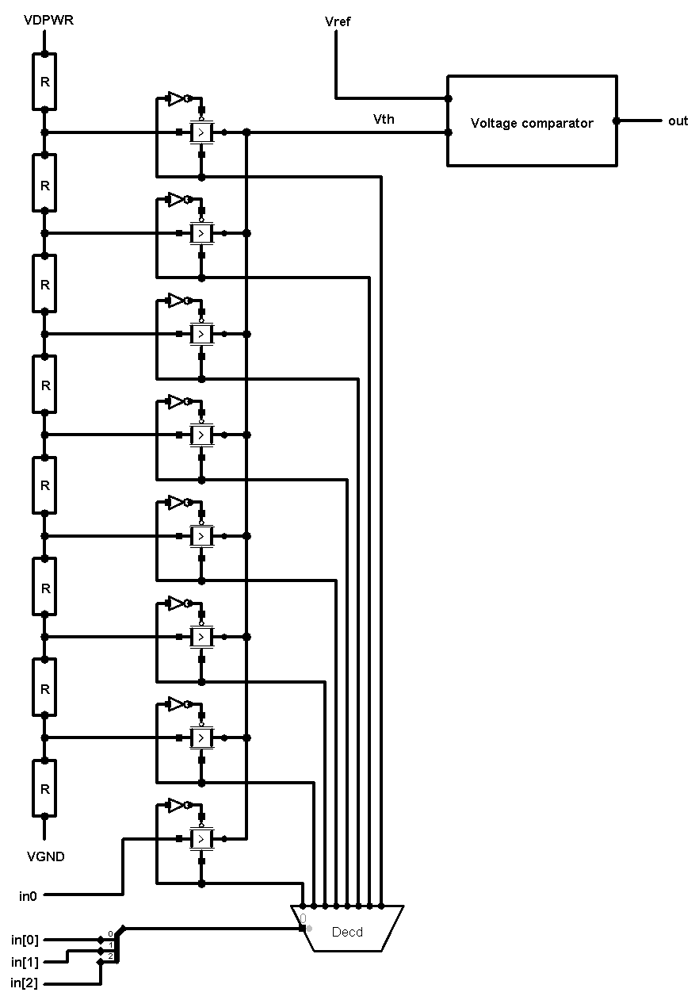
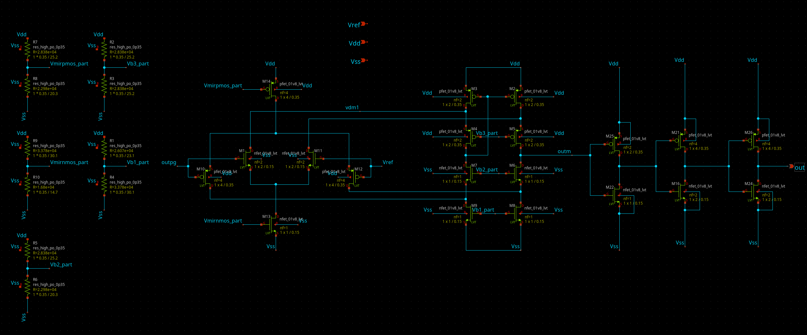
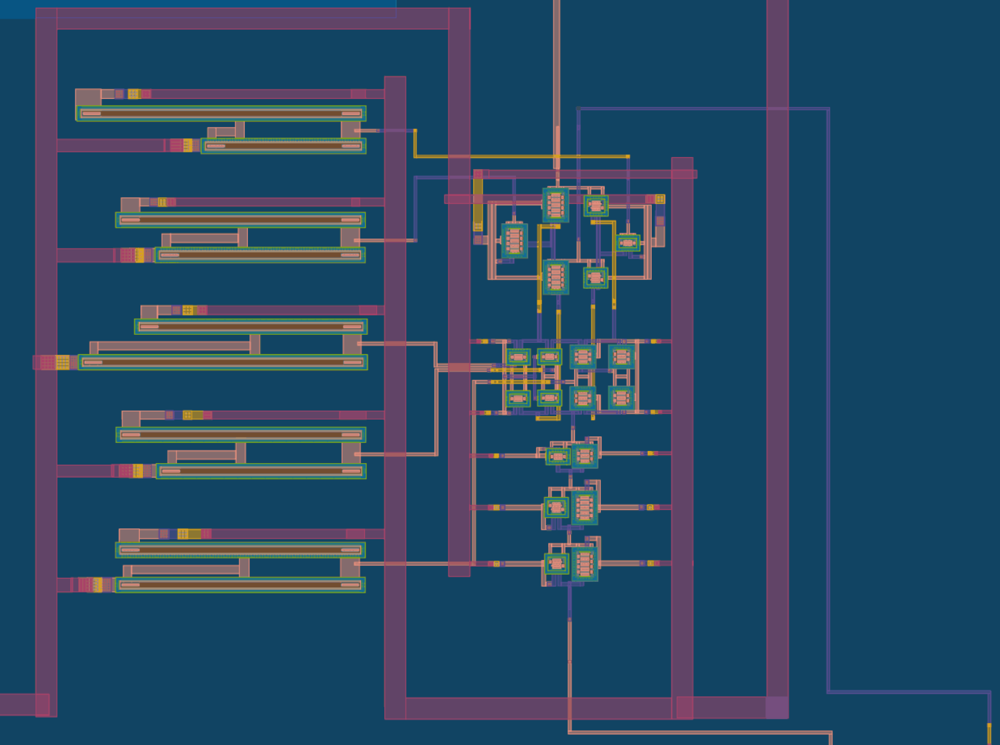
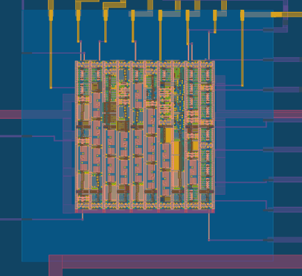

<!---

This file is used to generate your project datasheet. Please fill in the information below and delete any unused
sections.

You can also include images in this folder and reference them in the markdown. Each image must be less than
512 kb in size, and the combined size of all images must be less than 1 MB.
-->

## How it works

This programmable threshold voltage comparator allows comparing a voltage provided externally by the user (**Vref** signal) with a voltage level (threshold). The threshold voltage selection is controlled by 3 digital signals (**in[0], in[1]** and **in[2]** signals), which allow selecting one of the 8 possible threshold voltage levels. 7 of these levels are fixed (from 001 to 111 code), and only one (000 code) can be set by the user (**in0** signal). 

The output voltage (**out** signal) will be high (1.8V) when the selected threshold voltage is lower than **Vref** (**Vth < Vref**); otherwise, it will be low (0V).

The image below gives a simple overview of the entire project. 

We can see all used components. We have **8 equal resistors** whom provide fixed thresholds for **7 passgates**. The one at the bottom is linked to external pin **in0** for free user voltage threshold. Every passgate is built using Pmos and Nmos both. 
Every passgate's gates are linked to **decoder**, who provides direct and negative signal to enable or disable each passgate. 

Values of resistance and fixed voltage thresholds can be read opening **xschem/analog.sch** file with **xschem**.

The next section explains how **Voltage comparator** is made.

## Voltage comparator 

Compare inputs between 0 and 1.8 V on both Vref and outpg. The output goes to 1.8 V (logic 1) if Vref > outpg; otherwise, it goes to 0 V (logic 0).

|      | Min | Max | 1 logic | 0 logic |
| ---- | --- | --- | --- | --- |
| Output current | - | 150μA | - | - |
| Vref | 0V | 1.8V | - | - |
| outpg | 0V | 1.8V | - | - |
| out | 0V | 1.8V | - | - |
| Zout | - | - | ~ 11.5KΩ| ~ 2.8KΩ |

## Decoder 3 to 8

In **verilog/rtl** folder you can find the verilog file used to generate **gds/decoder_p.gds** and gate level verilog file (in gl folder). Note that **hardening process** (who creates **.gds** and GL file) was made using commands of MakeFile contained in Matt Venn's R2R DAC example's (https://github.com/mattvenn/tt06-analog-r2r-dac). 

## Performance

Rise time of **out** signal (from 0.2V to 1.6V) is 8.5ns. 

Fall time of **out** signal (from 1.6V to 0.2V) is 19ns.

Maximum switching frequency of all input signals (even if they switch all at the same time) is **100KHz**, i.e. all signals can switch at the same time, but the fastest one MUST NOT exced 100KHz. 

|      | Min | Max | Typical |
| ---- | --- | --- | --- |
| VDPWR | - | - | 1.8V |
| VGND | - | - | 0V |
| Vref | 0V | 1.8V | - |
| in0 | 0V | 1.8V | - | - |
| Switching frequency (all inputs) | - | 100KHz | - |
| Rise time | - | - | 8.5ns |
| Fall time | - | - | 19ns |

## How to test
- **VDPWR** voltage (supply voltage): 1.8V

- **VGND** voltage (supply voltage): 0V

- **Vref** voltage range (voltage reference for comparison): 0V to 1.8V

- **in0** voltage range (free voltage threshold): 0V to 1.8V

- **in[0], in[1], in[2]** (digital inputs): 0V (logically 0), 1.8V (logically 1)

- Maximum switching frequency of all input signals (even if they switch all at the same time) is 100KHz.

