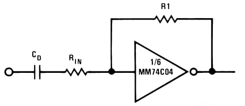

<!---

This file is used to generate your project datasheet. Please fill in the information below and delete any unused
sections.

You can also include images in this folder and reference them in the markdown. Each image must be less than
512 kb in size, and the combined size of all images must be less than 1 MB.
-->

## How it works

An inverter is biased for linear mode operation. 

  

A multiplexer (MUX) is connected in parallel with the feedback resistor (R2 = 300 kΩ).  
- By default, no additional resistor is connected in parallel.  
- When the MUX selects a resistor, it is placed in parallel with R2, reducing the effective resistance and changing the gain.  

The possible R2 effective values are:  
- Default: 300 kΩ  
- With 3 kΩ in parallel = ~2.97 kΩ  
- With 30 kΩ in parallel = ~27.3 kΩ  
- With 100 kΩ in parallel = ~75 kΩ  

## How to test

1. Connect a 20 nF capacitor at the input.  
2. Apply the test input signal:  
    - DC offset = 0 V  
    - Amplitude = 10 mV  
    - Frequency = 10 kHz
3. Observe the output waveform using an oscilloscope.  
4. Change the MUX selection (3 kΩ, 30 kΩ, or 100 kΩ) using the digital input pins (ui_in[0] and ui_in[1]) to vary the gain by changing the parallel resistance with R2.  
5. You may use the **mixedsignal_sym_tb.sch** testbench as a guide for the setup. 

  

## External hardware

- Oscilloscope  
- 20 nF capacitor  

## Results
S1 = 0 & S2 = 0

  

S1 = 0 & S2 = 1

  

S1 = 1 & S2 = 0

  

S1 = 1 & S2 = 1

  

