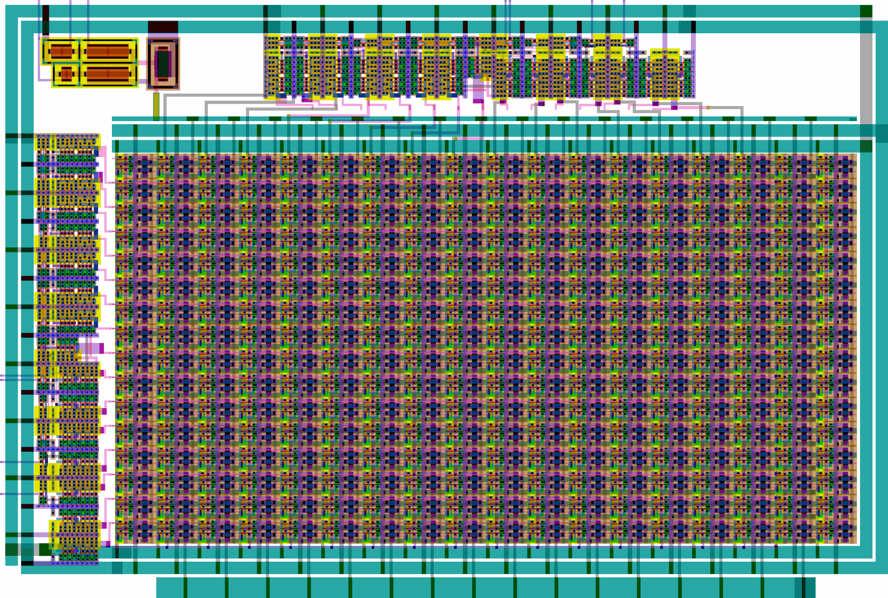

<!---

This file is used to generate your project datasheet. Please fill in the information below and delete any unused
sections.

You can also include images in this folder and reference them in the markdown. Each image must be less than
512 kb in size, and the combined size of all images must be less than 1 MB.
-->

## How it works

TBC!

Continuing my previous VGA DAC experiments ([tt06-grab-bag](https://github.com/algofoogle/tt06-grab-bag), [tt08-vga-fun](https://github.com/algofoogle/tt08-vga-fun), and [ttihp0p3-antonalog](https://github.com/algofoogle/ttihp0p3-antonalog)), this implements three current-switching DACs, intended for generating analog VGA display signals, using a 16x16 matrix of unit current sources, converting 8-bit digital inputs to inverted analog current sink "outputs" in the range of 3.3V down to 1.3V (depending on external pull-up resistance).

NOTE: At the time of writing, the display controller digital block is not yet implemented, but is expected to be done before tapeout and will be based on my previous projects listed above.

## How to test

TBC!

Use a pull-up resistor on each of the red, green, and blue analog output pins -- pull up to 3.3V using (say) a 500-ohm or 1k resistor, then shift this to 0-0.7V using an inverting opamp configuration. Alternatively, use a TIA (Transimpedance Amplifier) externally.

Set Vbias internally using digital inputs (through 8 possible levels).

## External hardware

TBC!

*   VGA display.
*   3 opamp circuits for converting each colour channel's current sink to a 0-0.7V range.
