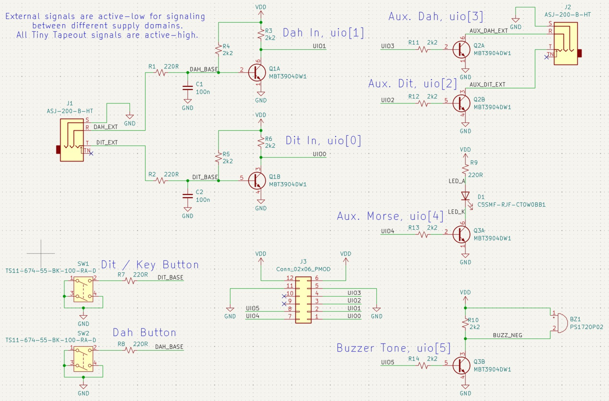

<!---

This file is used to generate your project datasheet. Please fill in the information below and delete any unused
sections.

You can also include images in this folder and reference them in the markdown. Each image must be less than
512 kb in size, and the combined size of all images must be less than 1 MB.
-->

## How it works

Morse Keyer takes a paddle-type dit/dah signal (io[0:1]) and converts it to an auxilliary Morse code output (io[4]) and a buzzer tone (io[5]).
The design outputs auxilliary dit/dah signals (io[2:3]) to send to other gear, like a radio.
Additionally, it outputs to the demonstration board's seven-segment display (out[7:0]) to reveal the character you just completed as you key.

To use a straight-key input (or press a single button to key Morse code) set in[0] HIGH. For Iambic paddles, set in[0] LOW.
To use Iambic keying type A, set in[1] LOW. For Iambic-B, set in[1] HIGH. (https://ag6qr.net/index.php/2017/01/06/iambic-a-or-b-or-does-it-matter/)
WPM control is set between 7 WPM and ~100 WPM with in[7:4] via the demo board dip switches.
The timing element in this system divides the system clock first with a 512x prescaler, then feeds it into the variable delay below:

| Control [7:4] | WPM   | Clocks | Timer Preset     |
| ------------: | :---: | :----: | :--------------: |
| 4'b0000       | 110.3 | 255    | 12'b000011111111 |
| 4'b0001       | 55.0  | 511    | 12'b000111111111 |
| 4'b0010       | 36.7  | 767    | 12'b001011111111 |
| 4'b0011       | 27.5  | 1023   | 12'b001111111111 |
| 4'b0100       | 22.0  | 1279   | 12'b010011111111 |
| 4'b0101       | 18.3  | 1535   | 12'b010111111111 |
| 4'b0110       | 15.7  | 1791   | 12'b011011111111 |
| 4'b0111       | 13.7  | 2047   | 12'b011111111111 |
| 4'b1000       | 12.2  | 2303   | 12'b100011111111 |
| 4'b1001       | 11.0  | 2559   | 12'b100111111111 |
| 4'b1010       | 10.0  | 2815   | 12'b101011111111 |
| 4'b1011       | 9.2   | 3071   | 12'b101111111111 |
| 4'b1100       | 8.5   | 3327   | 12'b110011111111 |
| 4'b1101       | 7.9   | 3583   | 12'b110111111111 |
| 4'b1110       | 7.3   | 3839   | 12'b111011111111 |
| 4'b1111       | 6.9   | 4095   | 12'b111111111111 |

WARNING: The auxilliary Morse output MUST NOT be used as a raw radio TX control for a homemade radio. This is because the keying interface must control the transmitted wave shape to maintain acceptable RF bandwidth. Be a good RF neighbor. Always use the provided keyer inputs for your radio. These are typically provided with a 3.5mm TRS jack, with Sleeve = GND, Ring = Dah, and Tip = Dit/Straight.

Most radio systems use active-low / open-collector signaling to protect systems operating at various supply voltages. Please see the External Hardware section for recommendations.

## How to test

Set the input clock frequency to 12 MHz.
Set the dip switches (in[7:0]) on the dev board to the desired paddle setup and WPM rate.
Attach hardware like that shown in the External Hardware section to use.

## External hardware

For the best experience, and to use custom radio hardware and paddles, I recommend assembling a companion PCB affixed the bidirectional PMOD.

A /pcb/ directory accompanies the standard Tiny Tapeout directories with the KiCad files.

Please see the schematic below for a screenshot of the recommended application schematic:

