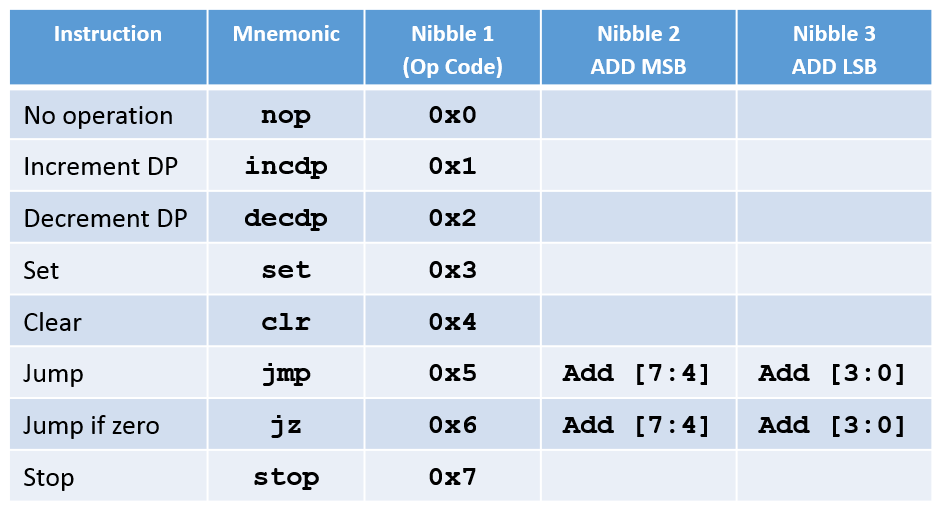
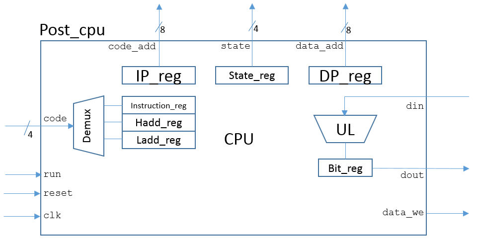
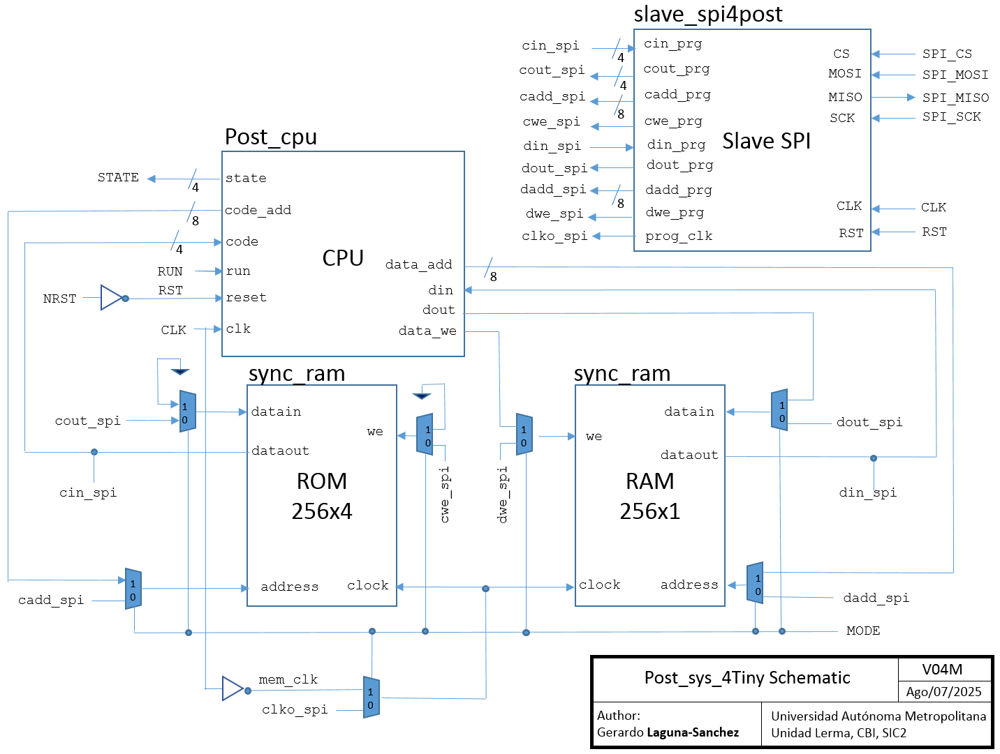
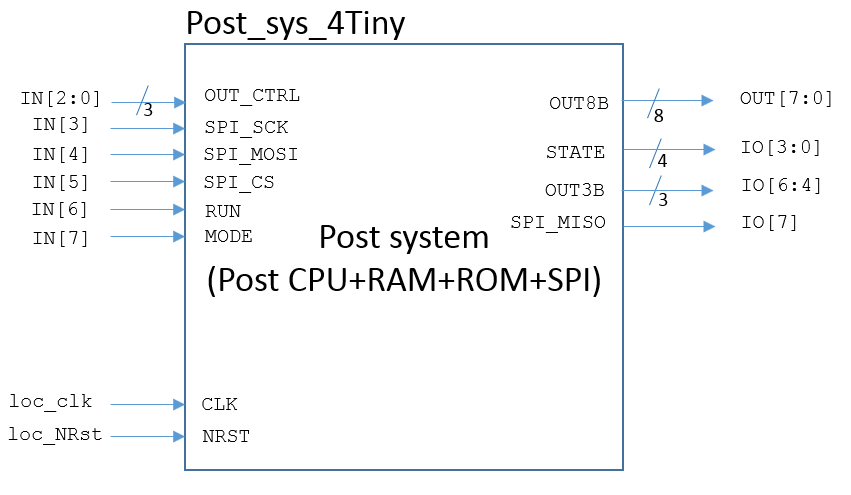
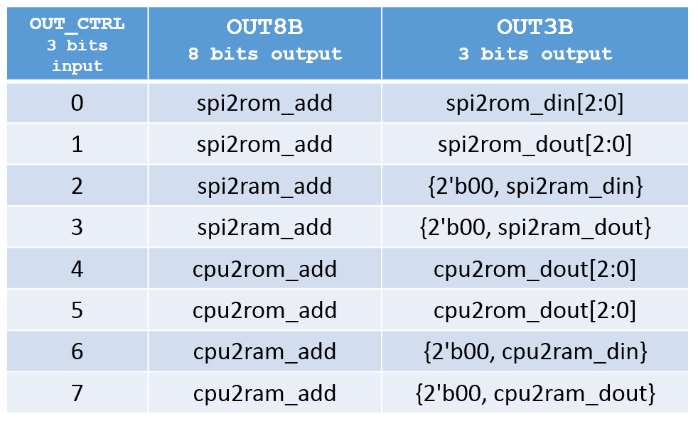
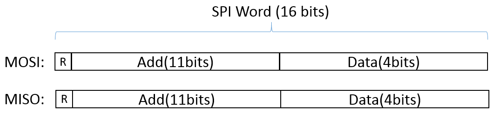
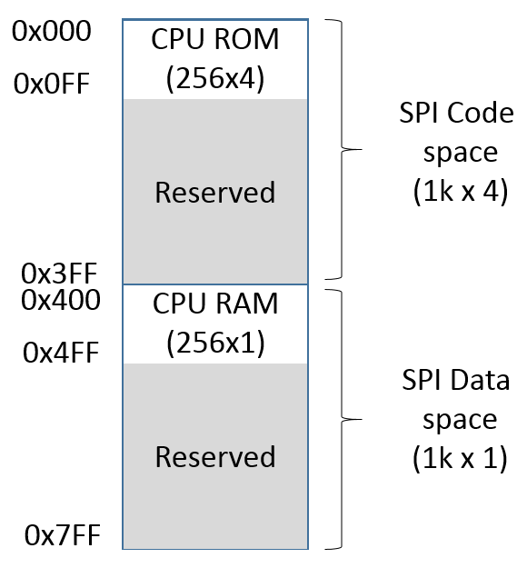
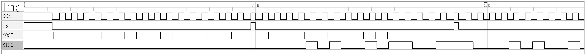

## How it works

A small architecture for practical implementation of a central processing unit (CPU) is proposed based on an improved Post's Machine. The Post's Machine is like Turing's machine but with minor complexity because of a shortest instruction set. The proposed Post’s Machine project has potential as teaching resource, to experiment and verify the fundamental concepts of a simple computer architecture with its instruction set (in this case, only eight instructions). 

In the seminal work of Emil L. Post (Post, 1936), no real machine was specified but conceptualization and mental experiments were developed. Although the original Post's machine is sustained on the manipulation of an infinite set of boxes, these boxes may be represented, like in Turing's machine, by means of a tape with an infinite number of cells, each one numbered and with the possibility of being observed and marked/erased by a kind of reading/writing head.

To implement this project, some improvements are proposed to the original Post's machine. The introduced variant is called Enhanced Post's Machine or EPM. Firstly, the tape with cells is replaced with a Nx1 memory (i.e. N one-bit registers). In this representation, each cell corresponds to a memory register while the head corresponds to a data pointer (DP) that indicates the address (a no-negative integer) of the current working register in the data space. In this way, the first register is assigned to the address 0 while the last to N-1. The data space may be considered as a circular buffer, thus, when the DP exceeds the last address, it returns to the address 0.

Secondly, the code space is implemented by Nx4 memory (i.e. N four-bit registers). In this case an instruction pointer (IP) addresses the current instruction. Every instruction is executed in order, beginning with that located in address 0 and following the next, in ascending order, except when a jump instruction appears, in which case the IP is loaded with the target address.

The proposed instruction set is composed of eight instructions that can be conveniently codified with nibbles (i.e. 4 bits tuples). In the case of the jump instructions, unconditional and conditional, every instruction code is followed by two additional nibbles with absolute addressing information. Specifically, the first address nibble includes the most significant bits (MSB) while the second the least significant bits (LSB). The following table summarizes the proposed instruction codification:

Specifically, given the coding for the instruction set where the destination addresses are composed by 8 bits, this means that in the proposed architecture up to 256 registers (either code or data) can be accessed. Thus, the code space is implemented by a 256x4-bit memory (i.e. 256 four-bit registers) while the data space is implemented by a 256x1 bit memory (i.e. 256 one-bit registers). 
 
Because the proposed logical design includes an instruction pointer and a data pointer, it results in a Harvard architecture. A block diagram for the proposed digital CPU architecture, with minimal functional blocks, is presented in the following figure:  

To enable user access to both code and data memory spaces, before and after the execution of any program, the processing system includes a slave SPI communication block. In the following figure, a schematic with the main functional blocks of the project is presented:

 
The multiplexors are controlled by MODE signal to set the operation mode (programming/execution). Additionally, RUN signal is dedicated to start the code execution. 

In practice, to work with the input and output ports of the Tiny Tapeout template, the entire system has been packaged in the Post_sys_4Tiny module, which is represented schematically below:

In the Post_sys_4Tiny module, the input bus OUT_CTRL is used to select the internal signal buses that will be available at the output ports OUT8B and OUT3B, according to the following table:

For mor details, see the HDL code Post_sys_4Tiny.v.

## How to test

The CPU system must be programed before a code execution. The RAM and ROM loads are enabled with signal MODE=0. With signal MODE=1, the code execution starts with signal RUN=1.  

To program the code space and access the data space, SPI transfers are used. The SPI word size is 16 bits with the following format:

The bit 15 (MSB) is set to specify a read operation. The address field specifies the location being accessed and de data field contains the information to be written or read. In the following figure, the SPI addressing map is presented:

  

For SPI transfers, the following specification is assumed:
- CS signal is active low, and it idles high. 
- SCK signal is active low, and it idles high.
- Data is valid on the second SCK edge (rising or falling) after CS has been asserted. 
- The most significant bit is the first to be transmitted.

In the case of a read sequence, the read command must be followed by a stuff SPI word (let's say, all ones or all zeros word). The read information will be in the data field of the SPI word transmitted by the slave SPI.  

Within the slave_spi4post module, the SCK frequency is assumed as CLK/8. For example, if the CLK frequency is 50 MHz, the SCK frequency is 6.25 MHz. SPI interface also works with low frequency, for example, if CLK frequency is 1525.879 Hz, the SCK frequency is 190.8 Hz.

As reference, in the following figure, the timing diagram with the SPI transfers for a write/read sequence is illustrated:

The showed SPI write/read sequence includes:

- SPI Command to write 0x9 in 0xA5 ROM address.
- SPI Command to read from 0xA5 ROM address.
- SPI stuff word to retrieve the read data.
     
Once both code a data are loaded in corresponding ROM and RAM memory, the code may be executed as has been specified above. 

As a quick reference, although rough but illustrative, you can refer to the test code test.py.

## Additional hardware

As practical reference, a master SPI module, both VHDL and Verilog code, may be found in the following repository:

https://github.com/galaguna/Packaged_Enhanced_Posts_Machine.git

## Additional information

More detailed information about the instruction set and basic architecture of EPM CPU may be found in the following repository:
 
- Laguna-Sanchez, G.A. (2020). The Post’s Machine Reloaded Booklet.
https://github.com/galaguna/Posts_Machine_Reloaded_Booklet.git

## References
- Post, E.L. (1936). Finite combinatory processes – formulation 1. The Journal of Symbolic Logic, Vol. 1, No. 3, pp. 103-105.
