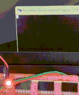

<!---

This file is used to generate your project datasheet. Please fill in the information below and delete any unused
sections.

You can also include images in this folder and reference them in the markdown. Each image must be less than
512 kb in size, and the combined size of all images must be less than 1 MB.
-->

## How it works
This is just an UART + small WS2812b single led driver

Listens to ascii 'MARCO' and once detected, with 10us delay (mega fast) replies with '\n\rPOLO!\n\r' and blips the LED from red to green.    
    
[FPGA tested :)](https://www.linkedin.com/posts/javiermu%C3%B1oz_verilog-uart-fsms-activity-7348657715633647617-CXaE/)

## How to test
The device will need 50Mhz clock. (provided by the RP2 )

Connect ui[0]: "uartRX" and uo[0]: "uartTX" with your favourite UART gizmo, i used my PC and FTDI FT2232HQ USB-UART bridge builtin my ArtyS7 evaluation board.

with default putty serial settings 9600 bauds 
8 data bits 
1 stop bit 
parity NONE 

and type uppercase 'MARCO' trough UART RX pin
you should receive a '\n\rPOLO!\n\r' on UART TX pin

Some extra debugging signals are also exposed :     
-  uo[1]: "baud_tick_rx" //clock for 9600*8 bauds
-  uo[2]: "baud_tick_tx" //clock for 9600 bauds   
-  uo[3]: "trigger_send" //flank signaling the start of uart txing
-  uo[4]: "uartTxbusy"  //stays high as long as uart is Txing
-  uo[5]: "led_data_out"    //connect the single WS2812b led here.

## External hardware

probably a USB to TTL dongle like CP2102,
and a WS2812b led