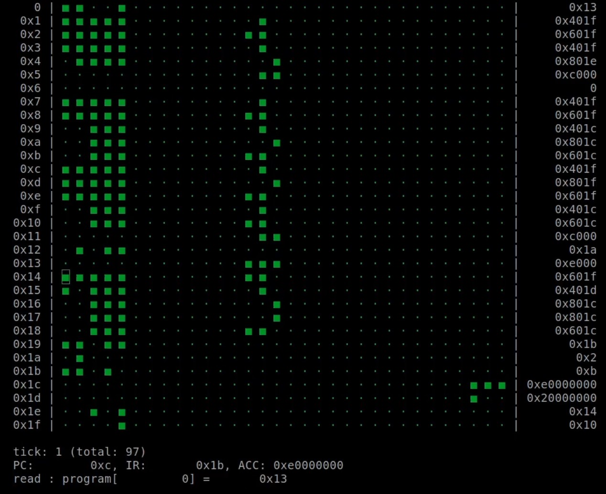
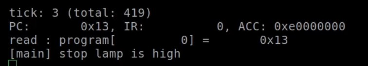

<!---

This file is used to generate your project datasheet. Please fill in the information below and delete any unused
sections.

You can also include images in this folder and reference them in the markdown. Each image must be less than
512 kb in size, and the combined size of all images must be less than 1 MB.
-->

## History of the Manchester Baby

The Manchester Baby, also known as the Small-Scale Experimental Machine, is a historically significant computer for being the first to execute electronically-stored programs. It uses 32-bit words, can access 32 unique memory addresses and execute 7 different instructions. A quirk of its implementation is that it negates a value when it is being loaded, therefore using a subtractor instead of an adder.

### Instruction Set

| Number | Mnemonic | Operation |
| :- | :- | :- |
| 0 | JMP | Copy content of specified line into the program counter |
| 1 | JRP | Add content of specified line to the program counter | 
| 2 | LDN | Negate and load content of specified line into the accumulator |
| 3 | STO | Store the content of the accumulator to the specified memory address |
| 4 | SUB | Subtract the content of the specified line from the accumulator |
| 5 | SUB | As above |
| 6 | CMP | If the accumulator is less than 0, increment program counter |
| 7 | STP | Halt the Baby and light the stop lamp |

## Interfacing with the Baby
I recommend interfacing with the Baby with another Pico; in fact I've written a program to help you do just that: https://github.com/krisjdev/pico-baby-if/

Other microcontrollers can be used, but you would have to adjust the code slightly as it uses Pico SDK functions.

The Pico in this case would act as the RAM module for the Baby, since there isn't one present on the tile for this project. It uses nearly every single GPIO pin in order to provide the Baby with data input, output and control lines to make it function. The pre-defined pins can be found in ``babyif/pindefs.h`` in the aforementioned GitHub repo.

### Connectivity

Due to pin limitations, there was a need to serialise the I/O of the Baby in some form as there weren't enough to expose a 32-bit interface. Therefore, this design also contains two modules (effectively shift registers) which will either accept 4x 8-bit inputs and show them to the Baby as one 32-bit value (PTP_A) or allow you to shift out 160 bits as multiple 8-bit segments (PTP_B) in order to get information about RAM access or the state of the program counter, instruction register or accumulator. Please note that PTP_B is read only, so the program counter, instruction register or accumulator cannot be directly modified.

| Pico GPIO | ASIC I/O | Notes |
| :- | :- | :- |
| 9-2 | ui_in[7:0] | Data input, Pico pin 2 is bit 0 |
| 17-10 | ui_out[7:0] | Data output, Pico pin 10 is bit 0 |
| 18 | uio_in[0] | PTP_A control signal | 
| 19 | uio_in[1] | PTP_B control signal |
| 20 | uio_in[2] | PTP reset_n |
| 21 | clk | Clock |
| 22 | uio_out[7] | Baby RAM read/write intent
| 26 | rst_n | ASIC reset_n |
| 28 | uio_out[6] | Stop Lamp |

## How to test

If using the interface provided at https://github.com/krisjdev/pico-baby-if/, it will automatically begin executing a Turing Long Division program, found in ``program.c``. When this design was tested on an FPGA at 50MHz, the program took roughly 3-4 minutes to execute - although the majority of that was because of the constant writing to the terminal, sorry! 

You can disable the CRT-esque display by commenting out ``draw_crt();`` at the very beginning of the ``while(true)`` loop, which should considerably speed up the execution.

Once the program finishes executing, a message will appear that the stop lamp has gone high.

In the case of the given Turing Long Division program the answer should be ``0xe0000000`` at address ``0x1c``.

If you want to execute your own programs, simply modify the program array in  ``program.c``, compile and upload to the RP2040/Pico. You can find an example program and compiler at https://gitlab.com/charles.fox/comparch/-/tree/main/chapter07, or try using ``babyutils`` from https://github.com/andy-bower/babyutils. 

## External hardware

A Raspberry Pi Pico is recommended, although any microcontroller with >21 GPIO pins should do just fine with some work.
