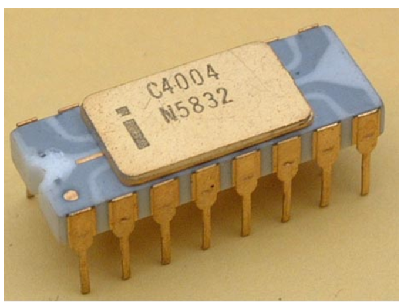
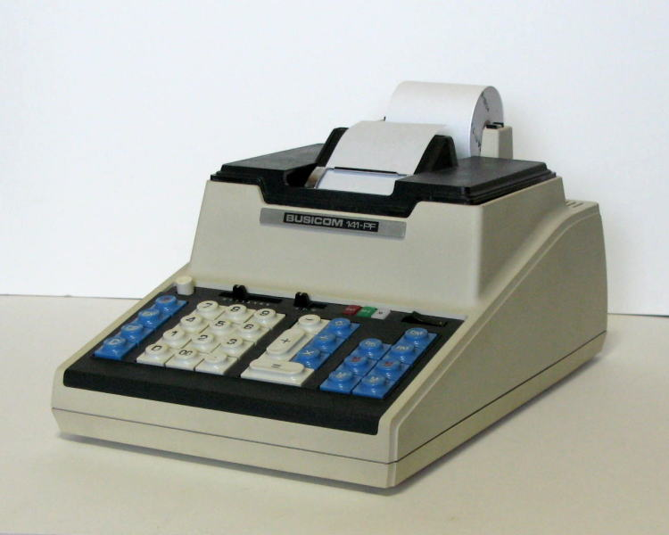
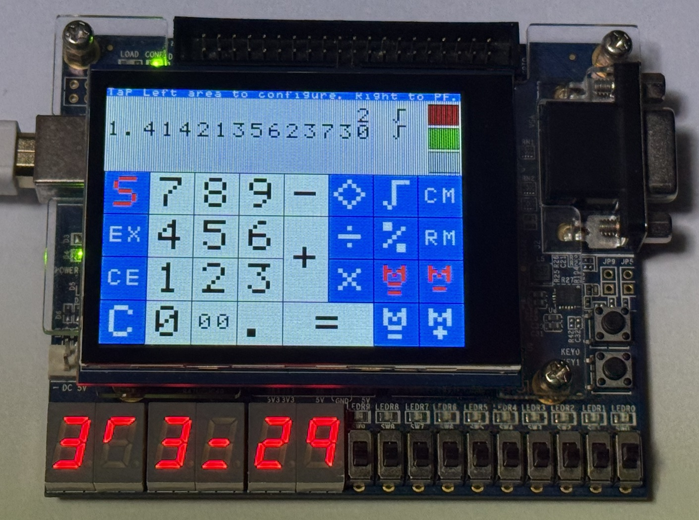
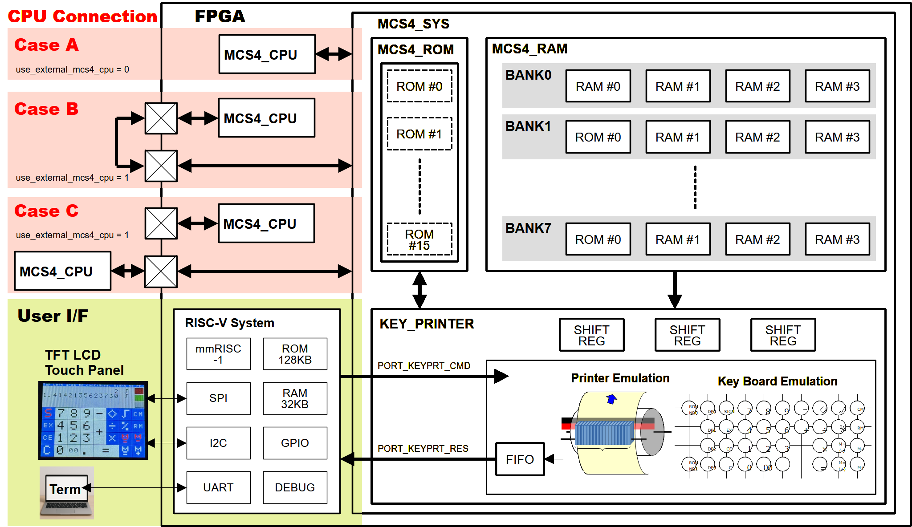

<!---

This file is used to generate your project datasheet. Please fill in the information below and delete any unused
sections.

You can also include images in this folder and reference them in the markdown. Each image must be less than
512 kb in size, and the combined size of all images must be less than 1 MB.
-->

## How it works

### Tapeout a 4004 CPU
This project aims to logically design the Intel 4004 (CPU), the centerpiece of the MCS-4
system, the world’s first microcomputer, using Verilog HDL, implement it on an TinyTapeout Chip,
and ultimately recreate the historic Busicom 141-PF calculator.

<!-- {width=75%} -->

### Works with companion FPGA
The peripheral chips of the MCS-4 system—4001 (ROM), 4002 (RAM), and 4003 (Shift Register)—along with the 141-PF calculator’s associated circuitry, are implemented on an FPGA. These components interface with the TinyTapeout Chip to function as a complete working calculator.

<!-- {width=25%} -->

<!-- {width=25%} -->

### User Interface of the Calculator
Unlike modern calculators that display results on LCDs, VFDs, or LEDs, the Busicom 141-PF printed output directly onto paper. It employed the Shinshu Seiki (now Seiko Epson) Model 102 printer.
This printer featured a continuously rotating drum embedded with embossed typefaces. Above the drum sat a layer of paper, ink ribbon, and a mechanical hammer. When a desired character on the rotating drum aligned with the target print position, the hammer would strike, transferring ink to paper.
The calculator received signals indicating the position of the rotating drum. From these signals, it determined which character would rotate into view next, and triggered hammers accordingly.
As a result, the printed output didn’t appear from left to right. Instead, characters were imprinted in non-linear order across the row—ultimately completing the full result in a surprisingly elegant manner. This was a highly efficient method for maximizing printing speed with drum-style printers, a testament to the ingenuity of early engineers.
The ink ribbon used a nostalgic black-and-red dual-color scheme, similar to those found in mechanical typewriters. By shifting the ribbon vertically, the calculator enabled two-color printing. In the case of the 141-PF calculator, negative numbers were rendered in red.

<!-- {width=75%} -->

### User Interface via RISC-V
Both the keyboard and printer interface are managed by a RISC-V subsystem embedded within the same FPGA. The calculator supports interaction via serial terminals as well as a touch-enabled LCD panel. Using the touchscreen panel gives the experience of operating a truly authentic vintage calculator.

<!-- {width=75%} -->

## How to test

### Logic Verification of the MCS-4 System
The logic verification process involves integrating the tapeout-targeted 4004 CPU (MCS4_CPU) with its companion FPGA system, which includes the 4001 ROM, 4002 RAM, 4003 Shift Register, and the peripheral circuitry of the 141-PF calculator—collectively referred to as the MCS-4 System (MCS4_SYS). The RISC-V subsystem that manages the user interface is excluded from the verification scope.

### Signal-Based Interface for Verification
The MCS4_SYS interacts with the RISC-V subsystem using two sets of 32-bit signals:

- **Command Signal**: `PORT_KEYPRT_CMD[31:0]`  
  Carries input data such as keypress events from the calculator.

- **Response Signal**: `PORT_KEYPRT_RES[31:0]`  
  Includes output data related to printer control.

During verification, simulated key inputs are delivered via `PORT_KEYPRT_CMD[31:0]`, and the resulting printer control signals emitted through `PORT_KEYPRT_RES[31:0]` are evaluated against expected behavior. This methodology ensures proper operation of the internal logic without reliance on the external user interface.

## External hardware

Since the FPGA used is sufficiently large, it is possible to implement not only the MCS4_SYS but also the MCS4_CPU, allowing the 141-PF calculator to operate solely on the FPGA. However, it can also function by connecting the finalized chip produced via TinyTapeout.
To support this scenario, the FPGA design accommodates the following three configurations for CPU connection, selectable via onboard switches: 
• Case A: 4004 (CPU) connected internally to the FPGA’s MCS-4 system (ROM
and RAM) 
• Case B: 4004 logic implemented in the FPGA, interfaced to the internal MCS-4
system via external pins 
• Case C: Standalone 4004 chip connected via external pins to the FPGA’s internal MCS-4 system (ROM and RAM) 

Among these, Case B and Case C share an identical logical structure, differing only in their external connections. Case B is provided as a debugging option for experimental use of Case C. 

When receiving the TinyTapeout chip, the Case C should be used in a system connection shown in below. The "tt_multiplexer" signals, used to select this project of the MPW chip, can be generated from RISC-V subsystem integrated in the FPGA. 

<!-- {width=50%} -->

## Technical Information

Following TRM documents the complete redesign of the MCS-4 System, including the Intel 4004 CPU and the recreation of the Busicom 141-PF calculator. It includes Verilog HDL implementations, simulation methods, software resources, and a technical report exceeding 100 pages.
[📄 MCS4_System_TRM.pdf](https://github.com/munetomo-maruyama/MCS4_SYSTEM/blob/main/doc/MCS4_System_TRM.pdf)

The full design details of this system are stored in the following GitHub repository:
[🔗 MCS4_SYSTEM Repository](https://github.com/munetomo-maruyama/MCS4_SYSTEM)

## Firmware References

This project utilizes historical firmware related to the 141-PF calculator:
- [4001.code - Simulator with Flowchart](http://www.4004.com/assets/busicom-141pf-simulator-w-flowchart-071113.zip)  
- [Assembly Source – Busicom 141-PF Calculator](http://www.4004.com/2009/Busicom-141PF-Calculator_asm_rel-1-0-1.txt)

These resources are distributed under the following license:
- [Creative Commons Attribution-NonCommercial-ShareAlike 2.5](https://creativecommons.org/licenses/by-nc-sa/2.5/legalcode)
 

