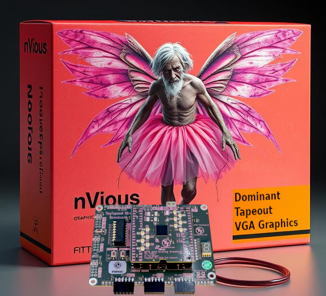
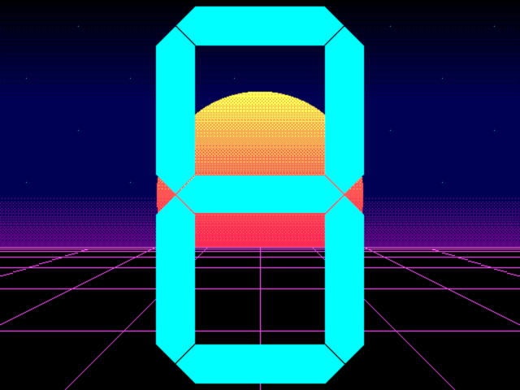

## How it works

This circuit adds retro graphics to existing Tiny Tapeout projects. Several
dozen previous and current projects make use of the 7-segment LED display. This
project leverages those existing circuits as a source input by connecting their
output to the input of this circuit and then connecting this circuit to a VGA
display. Potentially, the VSYNC signal could even be connected to the source
circuit to drive the clock and achieve frame synchronization--call it Tapeout
Synchronization, or T-SYNC. 

Below is an example of a frame from the VGA (640 x 480 @ 60 FPS) output.

## How to test

### Basic Functionality

No source input required.  Plug into a VGA monitor, select this circuit to
test, clock it at 25.175 MHz and reset. There is a VGA demo that runs without
input, but this circuit also accepts 8-bit input on the `ui_io[7:0]` pins to
display a virtual 7-segment LED display (with decimal).

### External Input

To test the user input functionality, connect the `ui_io[7:0]` pins to another
source input. The idea is that this would be a possibly useful graphical
extension to the dozens of existing projects that utilize the 7-segment LED
display to show their results on a monitor.

## External hardware

Requires the [TinyVGA PMOD](https://github.com/mole99/tiny-vga)
