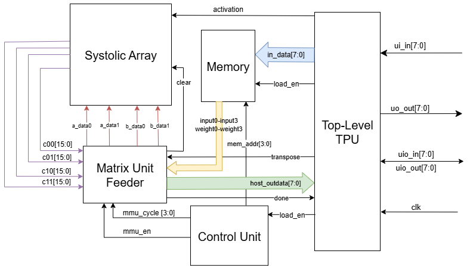
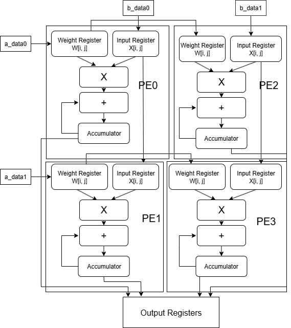
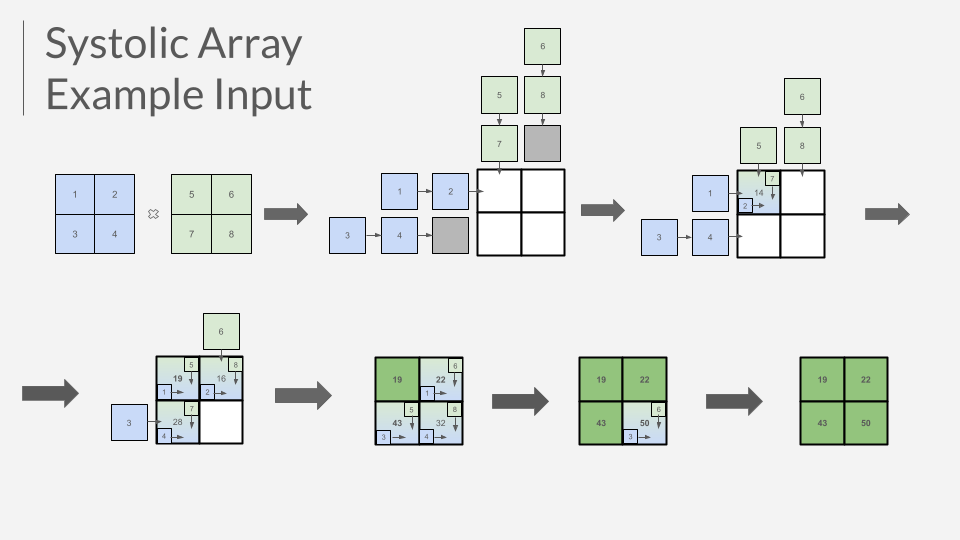
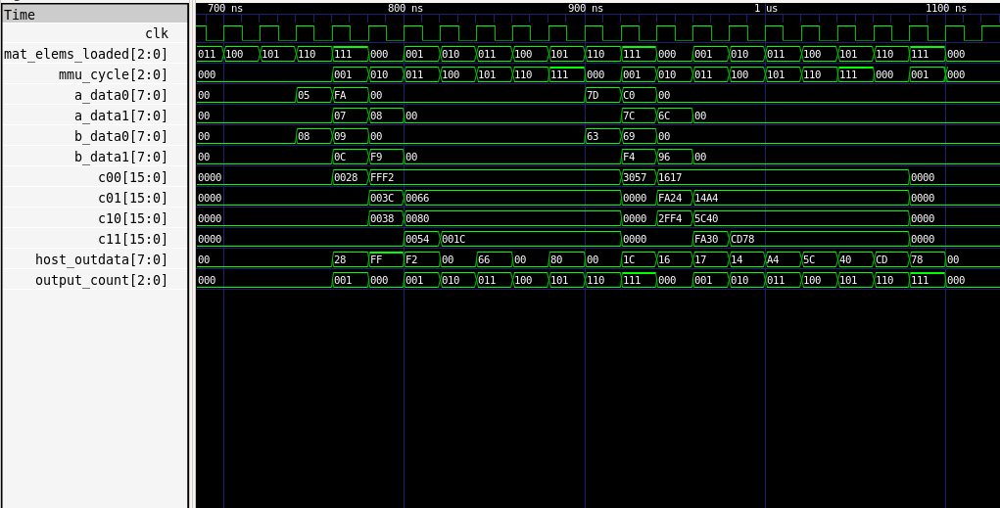

<!---

This file is used to generate your project datasheet. Please fill in the information below and delete any unused
sections.

You can also include images in this folder and reference them in the markdown. Each image must be less than
512 kb in size, and the combined size of all images must be less than 1 MB.
-->

## How it works

This project is a small-scale matrix multiplier inspired by the Tensor Processing Unit (TPU), an AI inference accelerator ASIC developed by Google.

It multiplies two 2x2 matrices with signed 8-bit (1 byte) elements to an output matrix with signed 16-bit (2-byte) elements. It does so in a systolic array circuit, where flow of data is facilitated through the connections between a grid of 4 Multiply-Add-Accumulate (MAC) Processing Elements (PEs).

To store inputs prior to computation, it contains 2 matrices in memory registers, which occupy a total of 8 bytes.

To orchestrate the flow of data between inputs, memory, and outputs, a control unit coordinates state transitions, loads, and stores automatically.

Finally, a feeder module interfaces with the matrix multiplier to schedule the inputs and outputs to and from the systolic array.

It is capable of running over 99.8 Million Operations Per Second when using a maximum throughput streamed processing pattern to multiply big matrices in 2x2 blocks.

## System Architecture

### The Processing Element

Let's start from the most atomic element of the matrix multiplier unit (MMU): its processing element (PE). The value stored within each PE contributes an element to the output.

|Signal Name        | Direction     |Width    | Description       |
|-------------------|---------------|---------|-------------------|
|clk                | input         |1        | The clock!        |
|rst                | input         |1        | Reset             |
|clear              | input         |1        | Clear PE          |
|a_in               | input         |8        | Input value       |
|a_out              | output        |8        | Pass-on of input  |
|b_in               | input         |8        | Weight value      |
|b_out              | output        |8        | Pass-on of weight |
|c_out              | output        |16       | Accumulation      |

Since each output element of a matrix multiplication is a sum of products, the PE's primary operation is a multiply-add-accumulate.

It will take input terms `a_in` and `b_in`, multiply them, and then add them to the accumulator value `c_out`. Due to the larger values induced by multiplication, the accumulator holds more bits.

Since adjacent PEs corresponding to adjacent elements of the output matrix need the same input and weight values, these input terms are sent to `a_out` and `b_out` respectively, which are connected to other PEs by the systolic array.

Once the multiplication is done, the control unit will want to clear the PEs so that they can reset the accumulation for the next matrix product, which is facilitated via the automatic `clear` signal. 

On the other hand, it is non-ideal to reset the entire chip, as it wastes time (an entire clock cycle) and is unnecessary to reset other elements such as memory.

The output is 16 bits for the 8-bit inputs, to account for the property of multiplication.

### The Systolic Array

|Signal Name        | Direction     |Width    | Description                     |
|-------------------|---------------|---------|---------------------------------|
|clk                | input         |1        | The clock!                      |
|rst                | input         |1        | Reset                           |
|clear              | input         |1        | Forwarded to PEs                |
|activation         | input         |1        | Enables ReLU                    |
|a_data0            | input         |8        | Input value of top-left PE      |
|a_data1            | input         |8        | Input value of bottom-left PE   |
|b_data0            | input         |8        | Input value of top-left PE      |
|b_data1            | input         |8        | Input value of top-right PE     |
|c00                | output        |16       | Top-left output value           |
|c01                | output        |16       | Top-right output value          |
|c10                | output        |16       | Bottom-left output value        |
|c11                | output        |16       | Bottom-right output value       |

The systolic array is a network, or grid, of PEs. In this 2x2 multiplier, the result is a 4-element square matrix, so there are 4 PEs.

Internally, the systolic array maintains internal registers and a matrix of accumulators that are read by and written into by the PEs.

This includes a 2x3 matrix for the input matrix values, a 3x2 matrix for the weight matrix values, and a 2x2 for the final output.

The extra values beyond 2x2 for input & weight matrix values are to allow the PEs at the edge of the grid to send their input/weight values to a register to a "garbage".

At each clock cycle, elements will flow between the PEs. The inputs will flow from "left to right", and the weights will flow from "top to bottom". To add new values, inputs have to be provided to the ports at the "left", and weights have to be provided to the ports at the "top".

Then, the PEs are instantiated using the Verilog compile-time construct of `genvar`, in which signals of the PE are connected to specified indices of the internal systolic array signals. Makes the code clean and easy to write!

Diagram of PE arrangement below:

### Unified Memory

The unified memory module (`memory.v`) is an on-chip store that holds both weight and input matrices for quick access to both values during computations.

|Signal Name        | Direction | Width | Description                           |
|-------------------|-----------|-------|---------------------------------------|
|clk                | input     | 1     | System clock                          |
|rst                | input     | 1     | Active-high reset                     |
|load_en            | input     | 1     | Enable signal for matrix loading      |
|addr               | input     | 3     | Memory address for matrix elements    |
|in_data            | input     | 8     | Current input matrix                  |
|weight[0,1,2,3]    | output    | 8     | Weight matrix elements                |
|input[0,1,2,3]     | output    | 8     | Input matrix elements                 |

The only source of the memory will come from `ui_in` ports directly. When `load_en` goes high, the current element (`in_data`) connected to all bits at the dedicated input `ui_in` is loaded into memory at its specified byte address, on the next rising edge. 

Matrix elements are held internally within an 8x8 register (`sram`). In terms of outputs, `sram[0..3]` maps to `weight[0..3]`, `sram[4..7]` maps to `input[0..3]`. An address (`addr`) is generated by the control unit to correctly load elements into the internal register.

The entire memory space of 8 bytes is visible at the output ports asynchronously.

### Control Unit

The control unit (`control_unit.v`) serves as the central orchestrator for the entire TPU, coordinating the flow of data between memory, the systolic array, and output collection through a carefully designed finite state machine (FSM).

|Signal Name        | Direction | Width | Description                           |
|-------------------|-----------|-------|---------------------------------------|
|clk                | input     | 1     | System clock                          |
|rst                | input     | 1     | Active-high reset                     |
|load_en            | input     | 1     | Enable signal for matrix loading      |
|mem_addr           | output    | 3     | Memory address for matrix elements    |
|mmu_en             | output    | 1     | Enable signal for MMU operations      |
|mmu_cycle          | output    | 3     | Current cycle count for MMU timing    |

#### State Machine Architecture

The control unit implements a 3-state FSM that manages the complete matrix multiplication pipeline:

1. **S_IDLE (2'b00)**: The default waiting state where the system remains until a matrix multiplication operation is requested via the `load_en` signal.

2. **S_LOAD_MATS (2'b01)**: The matrix loading phase when 8 matrix elements (4 for each 2x2 matrix) are sequentially loaded into memory. Because the order is already assumed to be row-major order, left matrix first, then the address value tracked in `mem_addr` will only increment when `load_en` is asserted, from 0 up until 7 when it resets to get ready for future input matrices.

3. **S_MMU_FEED_COMPUTE_WB (2'b10)**: The computation and output phase, taking 8 cycles total when the systolic array performs the last few operations of matrix multiplication, and makes the 4 outputs available in 16 bits each, 1 every 2 cycles. At the same time, the chip is available for streamed processing so that 8 new elements, representing 2 new 2x2 matrices, can be input for the next round of outputs occurring right after the current round. 

#### Orchestration Logic

The control unit coordinates several critical functions:

- **Memory Interface Management**: Through the `mem_addr` output (`control_unit.v:9`), it generates sequential memory addresses (0-7) during the loading and streaming phase, ensuring matrix elements are stored in the correct memory locations for later retrieval.

- **MMU Timing Control**: The `mmu_cycle` signal (`control_unit.v:13`) provides precise timing information to the MMU feeder module, enabling it to:
- Feed correct matrix elements to the systolic array at appropriate cycles
- Determine when computation results are ready for output
- Clear processing elements after computation completion

- **Pipeline Coordination**: The `mmu_en` signal (`control_unit.v:12`) acts as the master enable for the entire computation pipeline, transitioning from low during loading to high during computation phases. This is to ensure that elements are only loaded into the systolic array during the first round of set up inputs when all inputs are ready. Otherwise, if the chip is not initialized with all inputs in memory, it cannot complete computation and hence should not start it. 
    - However, for maximum throughput, the `mmu_en` signal is asserted when 6 of the 8 elements making up 2 matrices are input, so that computation begins when we have the elements to produce enough outputs, and is overlapped with matrix loads, and completes in the middle of the output cycle.

- **Streamed Processing**: During the 8-cycle output phase, the chip is available to take in 8 new input bytes provided at the `ui_in` ports. This is a streamlined flow of execution, as the input and output ports will henceforth be constantly used. After this 8-cycle output phase, the input bytes input during that phase can now begin outputting, while subsequent inputs can be further written.

    - However, if the user chooses not to write new inputs during the output phase, the outputs continue unabated, and the systolic array matrix accumulators automatically reset once the outputs are complete.

#### Critical Timing Relationships

The control unit implements sophisticated timing logic based on the systolic array's computational pipeline:

- **Cycle 0**: Initial data feeding begins (a00×b00 starts)
- **Cycle 1**: First partial products computed, additional data fed
- **Cycle 2**: First result (c00) becomes available, Next input group can begin.
    - Future value of A00 expected at input during streamed processing
- **Cycle 3**: Second and third results (c01, c10) become available simultaneously
    - Future value of A01 expected at input
- **Cycle 4**: Final result (c11) becomes available
    - Future value of A10 expected at input
- **Cycle 5**: All outputs remain stable.
    - Future value of A11 expected at input
- **Cycle 6**: Output continues
    - Future value of B00 expected at input
- **Cycle 7**: Output continues
    - Future value of B01 expected at input
- **Back to Cycle 0**: Output continues. Since 6 of 8 of the next input elements would be on chip, the next cycle of data feeding begins
    - Future value of B10 expected at input
- **Cycle 1 again**: Last output element, first partial products of next output are computed.
    - Future value of B11 expected at input
- **Cycle 2 again**: Repeat of description above, etc.

#### State Transition Logic

State transitions are triggered by specific conditions:
- `S_IDLE → S_LOAD_MATS`: When `load_en` is asserted (`control_unit.v:30-32`)
- `S_LOAD_MATS → S_MMU_FEED_COMPUTE_WB`: When all 8 elements are loaded (`mem_addr == 3'b111`) (`control_unit.v:37-38`)
- `S_LOAD_MATS → S_MMU_FEED_COMPUTE_WB`: When all 8 elements are loaded (`mat_elems_loaded == 3'b111`) (`control_unit.v:37-38`)
- Afterwards, the state machine stays in `S_MMU_FEED_COMPUTE_WB`, but essentially cycles through counts of `mem_addr` and `mmu_cycle` to keep track of the memory address writing for streamed processing and maintain a rhythm for the Matrix Unit Feeder.

#### Integration with Other Modules

The control unit interfaces with all major TPU components:
- **Memory Module**: Provides addressing (`mem_addr`) and coordinates write operations during loading
- **MMU Feeder**: Supplies enable signal (`mmu_en`) and cycle timing (`mmu_cycle`) for data routing and output selection
- **Top-level TPU**: Receives external `load_en` control signal and coordinates the entire operation sequence

This design ensures that matrix multiplication operations proceed automatically once initiated, with the control unit handling all timing dependencies and data flow coordination between the TPU's constituent modules.

### The Matrix Unit Feeder

The Matrix Unit Feeder (in `mmu_feeder.v`) is the interface between the control unit and the computational unit (MMU), facilitating smooth data flow between the internal components of the TPU and outputs to the host. When enabled, its role is to either feed the expected matrix data from host to MMU, or to direct computed matrix outputs from MMU to host; this is decided based on the mmu_cycle defined and cycled through (0-7 repeating constantly) by the control unit.

|Signal Name        | Direction | Width | Description                           |
|-------------------|-----------|-------|---------------------------------------|
|clk                | input     | 1     | System clock                          |
|rst                | input     | 1     | Active-high reset                     |
|en                 | input     | 1     | Enable signal for MMU operations      |
|mmu_cycle          | input     | 3     | Current cycle count for timing        |
|weight[0,1,2,3]    | input     | 8     | Weight matrix from memory             |
|input[0,1,2,3]     | input     | 8     | Input matrix from memory              |
|c[00,01,10,11]     | input     | 8     | Computed element output from MMU      |
|done               | output    | 1     | Signal to host that output is ready   |
|host_outdata       | output    | 8     | Data register to output to host       |
|a_data[0,1]        | output    | 8     | Output A to MMU for computation       |
|b_data[0,1]        | output    | 8     | Output B to MMU for computation       |

The weight and input matrices are taken from memory. The feeder will set the expected values of a_data0/1 and b_data0/1 depending on the value of mmu_cycle. Output values are 16 bits, but the maximum data width of the output ports is 8-bit so we have to feed half an element a cycle!
- **Cycle 0**:
    - Blank data is sent to the output port. a_data0 = weight[0], b_data0 = input[0], done = 0
- **Cycle 1**: 
    - During the initial cycle when the memory is first populated, cycle 1 occurs during the input of the second matrix, which also overlaps with compute as the counter has already incremented.
    - This module will send a value to its output that is equal to the lower 8 bits of the product of the A00 and B00, which are the top-left elements of the matrices. This is due to the settings that enable streamed processing. The chip should therefore ignore that output.
    - In terms of feeding the systolic array, if fused transpose is disabled, then a_data0 = weight[1], a_data1 = weight[2], b_data0 = input[2], b_data1 = input[1].
    - If fused transpose is enabled, the b_data0 and b_data1 values are swapped.
- **Cycle 2**:
    - In this cycle, the output counter is 0. The output sends the upper 8 bits of C00, the top-left output element.
    - To signal that the outputs are coming, the done signal is asserted, which is visible from the user.
    - The values given to the systolic array are a_data1 = weight[3], b_data1 = input[3].
- **Cycle 3**: 
    - In this cycle, the output counter is 1. The output sends the lower 8 bits of C00, the top-left output element.
    - Since we have finished sending all the last input values to the systolic array, intermediate feeds will have a value of 0, having no effect on the operation of MAC units.
- **Cycle 4**: 
    - In this cycle, the output counter is 2. The output sends the upper 8 bits of C01, the top-right output element.
- **Cycle 5**: 
    - In this cycle, the output counter is 3. The output sends the lower 8 bits of C01, the top-right output element.
- **Cycle 6**: 
    - In this cycle, the output counter is 4. The output sends the upper 8 bits of C10, the bottom-left output element.
- **Cycle 7**: 
    - In this cycle, the output counter is 5. The output sends the lower 8 bits of C10, the bottom-left output element.
- **Back to Cycle 0**: (set by control unit) 
    - In this cycle, the output counter is 6. The output sends the upper 8 bits of C11, the bottom-right output element.
    - The clear signal is asserted to make way for the computation of the next input to accumulate from 0.
    - Therefore, to preserve the lower 8 bits of C11 output in the next cycle, we assign the value to a "pipeline register", aptly named `tail_hold` as it holds the tail of the output.
    - The systolic array feeding pattern is the exact same as was shown above.
- **Cycle 1 Again**:
    - In this cycle, the output counter is 7. The output sends the lower 8 bits of C11, the bottom-right output element.
    - The output count resets to 0 automatically.

For similar details on timing relationships, see **Critical Timing Relationships** above, in the Control Unit section.

## How to test

Notation: the matrix element A_xy denotes a value in the xth row and yth column of the matrix A.

The module will assume an order of input of A matrix values and B matrix values, and outputs. That is, it is expected that inputs come in order of A00, A01, A10, A11, B00, B01, B10, B11, and the outputs will come in the order of C00, C01, C10, C11. This keeps the chip simple and avoids extra logic/user input.

### Setup

1. Power Supply: Connect the chip to a stable power supply as per the voltage specifications.
2. Clock Signal: Provide a stable clock signal to the clk pin.
3. Reset: Ensure the rst_n pin is properly connected to allow resetting the chip.

### A Matrix Multiplication Round

1. Initial Reset
    - Perform a reset by pulling the `rst_n` pin low to 0, and waiting for a single clock signal before pulling it back high to 1. This sets initial state values.
2. Initial Matrix Load
    - Load 8 matrix elements into the chip, one per cycle. For example, if your matrices are [[1, 2], [3, 4]], [[5, 6], [7, 8]], you would load in the row-major-first-matrix-first order of 1, 2, 3, 4, 5, 6, 7, 8. This occurs by setting the 8 `ui_in` pins to the 8-bit value of the set matrix element, and waiting one clock cycle before the next can be loaded.
3. Collect Output & Send Next Inputs
    - Thanks to the aggressive pipelining implemented in the chip, once the matrices are loaded, you can already start collecting output!
    - Output elements will be 16 bits each, but since the output port is only 8 bits, one element is output in 2 cycles, with the upper half (bits 15 - 8) in the first cycle, and the lower half (bits 7 - 0) in the second cycle.
    - To collect outputs, wait for a single clock edge, and then read the `uo_out` pin for the 8-bit value. Repeat again to get the full 16-bit value. Overall, the matrix output at `uo_out` will be in the order of c_00, c_01, c_10, c_11, taking 8 cycles to output 4 elements.
    - For the above example, the output would be in the order of [19, 22, 43, 50], starting from the cycle right after you finish your last load, and ending 8 cycles afterwards.
    - It is also recommended that in those same 8 cycles, the next 2 input matrices are sent to the `ui_in` pin. That will be 1 element per cycle for 2 serial, row-major 2x2 matrix inputs, for 8 cycles total.
4. Repeat
5. Input Options
    - Note that if new matrices are not input during the output cycle, i.e. the `ui_in` pin is set to 0, then it is the equivalent of     "flushing the pipeline", as once the output is complete, it is the equivalent of starting at step 2.

Below is a visual of an example matrix multiplication round through the systolic array. Note that while it behaves similarly to the chip, the chip's matrix inputs to the systolic array are the diagram's order inverted across the matrix diagonal.

### Matrix Multiplication Options

The example shown above is a very simple and plain 2x2 matrix multiplication. However, this TPU chip offers additional options. 

The first is the ability to compute the product $AB^T$, which is the first matrix multiplied by the transpose of the second. This saves time computing a transpose taken by a CPU instruction in $O(n^2)$ time, where n is a rough measure of the matrix dimension. Instead, it is fused with the entire process, taking no extra time.

The second is the ability to run the Rectified Linear Unit (ReLU) activation function, commonly seen in neural networks for approximating non-linear patterns in data. 

The third, which is provided as a software interface option, is the ability to multiply bigger matrices, of all compatible dimensions, in 2x2 blocks.

### Example Result

Below is a timing diagram showing signal progression for a streamed processing pattern of the TPU chip, generated by GTKWave:

The part highlighting Input/Output streaming is the fact that `mem_addr`, which increments whenever load is enabled, keeps incrementing like 0-7, 0-7, etc, and so is the output count, albeit slightly offset in time.

One can also observe the pattern in which elements are fed into the systolic array, as seen by `a_data0`, `a_data1`, `b_data0`, `b_data1` signals, and the output "waterfall" flow of output appearances seen inside `c00`, `c01`, `c10`, `c11`. 

### Scaling it up

Earlier, it was mentioned that you could scale the multiplication up to any dimension. What else does this mean? AI inference! We are able to run forward inference of a Quantization-Aware-Trained (QAT) machine learning model using the chip's logic. 

The model is trained to recognize black-and-white images of single handwritten digits from the MNIST dataset.

In the demonstration, which is kept simple, I run QAT on the local PC, and then run forward inference with this model on the chip. It was able to successfully recognize 2 out of 3 images in a test batch, which is far superior to a coin flip.

## External hardware

An external microcontroller will send signals over the chip interface, including the clock signal, which will allow it to coordinate I/O on clock edges.

## Acknowledgements

* William Zhang: Processing Elements, Systolic Array, Module Compilation & Integration, Pipelining Optimization
* Ethan Leung: Matrix Unit Feeder
* Guhan Iyer: Unified Memory
* Yash Karthik: Control Unit
* ECE 298A Course Staff: Prof. John Long, Prof. Vincent Gaudet, Refik Yalcin

An earlier iteration of this project is located at [this](https://github.com/YashKarthik/tpu) repository, in which the original plan was to submit to the IHP25B shuttle.
